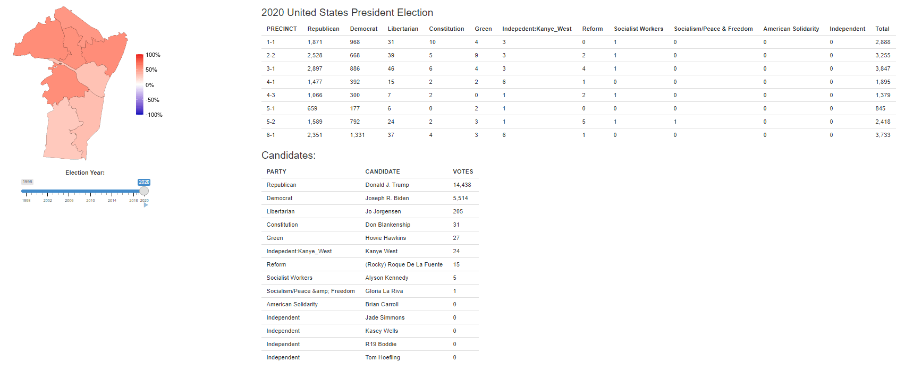

# Cheatham_Election_Data

This repository contains data useful to folks analyzing elections in Cheatham County TN.

The "data" folder contains two spreadsheets:

* "Cheatham_County_Data_for_US_Presidential_elections_1904_to_2020.csv" contains data on US Presidential elections in Cheatham from 1904 to 2020
* "Cheatham_Precinct_Data_for_state_federal_races_1998_to_2020.csv" contains data on state/federal elections in Cheatham from 1998 to 2020
* "Cheatham_Local_Election_Sample_Spreadsheet.csv" is a sample template to create a database of local elections

The "gis_shapefiles" folder contains GIS shapefile maps of county precincts going back to 2000.  These are useful if you are trying to map the data in the spreadsheets above.

I will, as time allows, add some example code using R to load, analyze, and graph/map the data.

